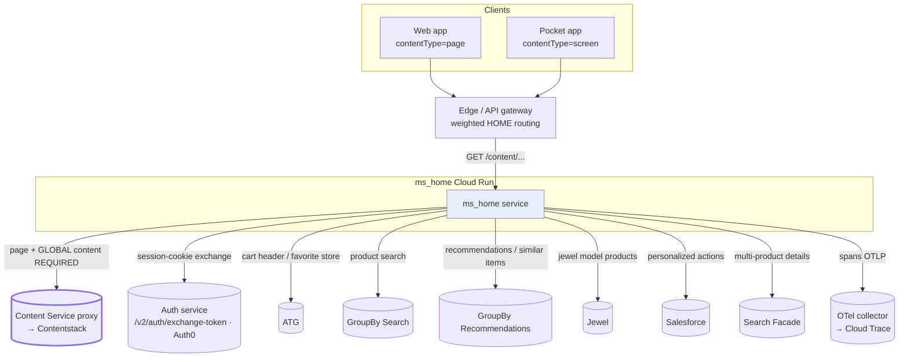
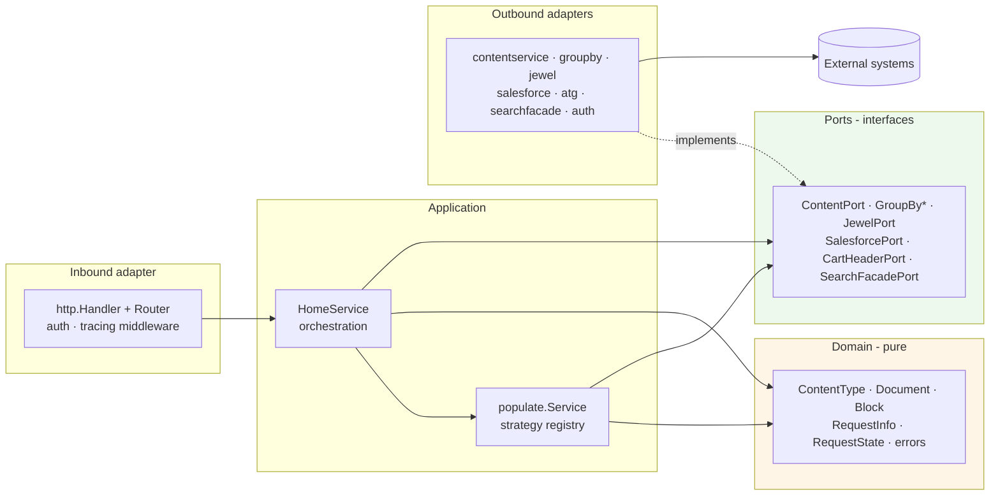
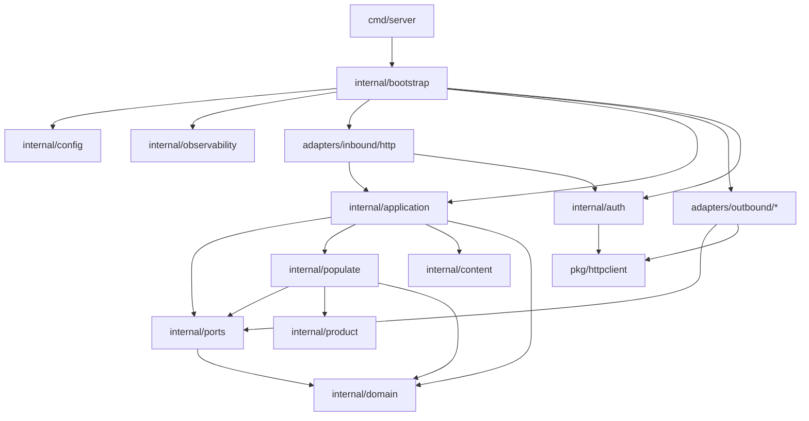
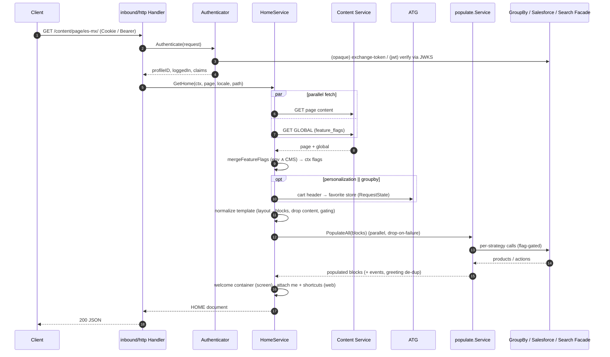
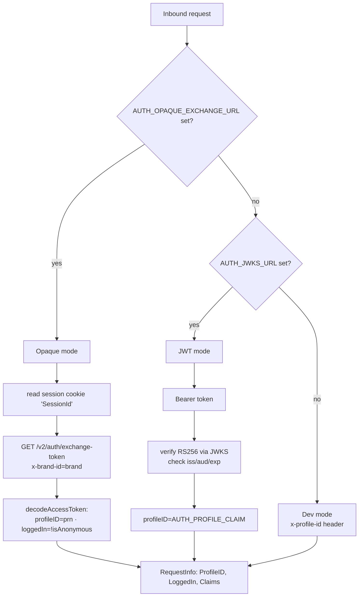
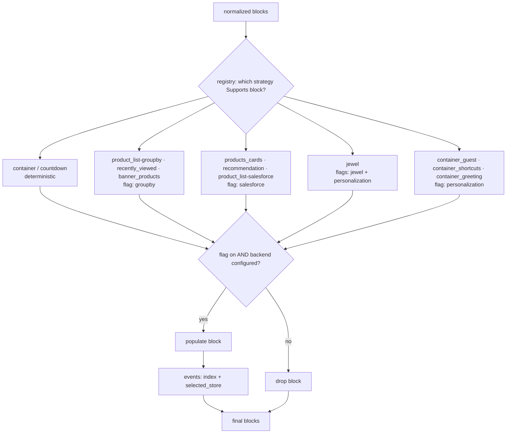
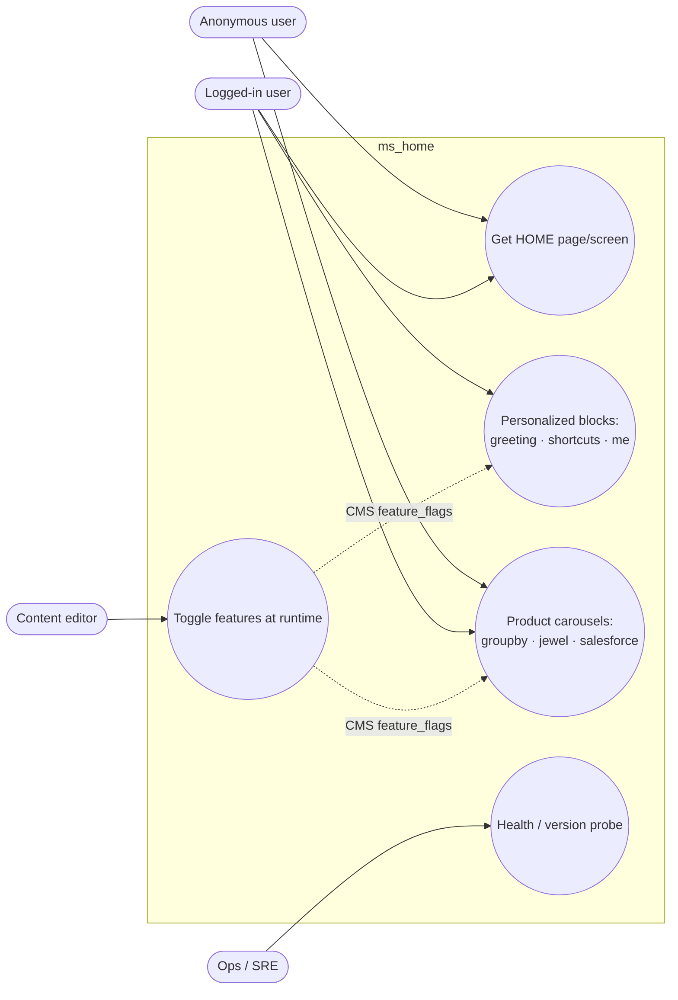

# Architecture

`ms_home` is a stateless Go service serving the **HOME** experience (web `page` +
pocket `screen`), migrated from `digital_bff`. **Hexagonal (Ports & Adapters)** —
dependencies point inward; the domain/application never import infrastructure.

> Diagrams use Mermaid. View on GitHub or any Mermaid-aware Markdown viewer.

---

## 1. System context (all systems involved)

Every outbound dependency is **optional** (enabled by setting its URL — see
[configuration.md](configuration.md)); only the Content Service is required.

| System | Purpose | Enabled by |
|---|---|---|
| Content Service proxy | HOME page + GLOBAL (feature flags) — **required** | `SHARED_CONTENT_SERVICE_URL` |
| Auth service (Auth0) | opaque session → claims (`prn`, `isAnonymous`) | `AUTH_OPAQUE_EXCHANGE_URL` (or local JWT via `AUTH_JWKS_URL`) |
| ATG | cart header → favorite store + last cart item | `SHARED_ATG_CART_HEADER_URL` |
| GroupBy Search | `product_list-groupby` carousels | `SHARED_GROUPBY_SEARCH_URL` |
| GroupBy Recommendations | recently-viewed + banner similar-items | `SHARED_GROUPBY_RECOMMENDATIONS_URL` |
| Jewel | jewel-model carousels | `SHARED_JEWEL_URL` |
| Salesforce | greeting/offers/recommendation actions | `SALESFORCE_MODULE_HTTP` |
| Search Facade | `banner_products` multi-product details | `SHARED_SEARCH_FACADE_URL` |
| OTel collector | trace export | `OTEL_EXPORTER_OTLP_ENDPOINT` |

---

## 2. Hexagonal layers (dependencies point inward)

Rule: arrows only point **toward** the domain. Adapters depend on ports (interfaces);
the application depends on ports, never on concrete adapters. SDK/HTTP types never leak
past an adapter.

---

## 3. Package layout & dependencies

| Path | Responsibility |
|---|---|
| `cmd/server` | entrypoint, HTTP server, graceful shutdown (+ tracing flush) |
| `internal/domain` | pure types: `ContentType`, `Document`, `Block`, `RequestInfo`, `RequestState`, errors |
| `internal/ports` | outbound interfaces (`ContentPort`, `GroupBy*Port`, `JewelPort`, `SalesforcePort`, `CartHeaderPort`, `SearchFacadePort`) |
| `internal/application` | `HomeService` — orchestration (port of `content.service.ts`) |
| `internal/populate` | strategy framework + 12 block strategies + events |
| `internal/content` | pure CMS transforms (normalization, gating, welcome) |
| `internal/product` | `ProductDto` + mappers (GroupBy/Jewel/Salesforce/SearchFacade) |
| `internal/adapters/inbound/http` | handler, router, auth, tracing middleware |
| `internal/adapters/outbound/*` | one client per backend |
| `internal/auth` | JWT verifier + opaque-token exchange |
| `internal/config` · `internal/observability` | env config · slog + OTel |
| `internal/bootstrap` | compile-time wiring (no reflection) |
| `pkg/httpclient` | shared HTTP client (keep-alive, logging, cURL@debug, masking, client spans) |

---

## 4. HOME request — communication sequence

End-to-end flow of `GET /content/page/es-mx/` for a logged-in web user
(personalization + groupby + salesforce on). Optional calls run only when their flag
+ backend are enabled.

---

## 5. Authentication modes

Mode is chosen at startup by which env var is set (precedence shown).

Invalid/absent credentials → **anonymous** request (HOME still served; personalization off).
Claims feed the `me` projection. See [decisions.md](decisions.md) D8.

---

## 6. Populate framework & feature-flag gating

Each block is routed to the strategy that `Supports()` it; a strategy may keep, mutate,
or **drop** the block (drop-on-failure). Flags come from the GLOBAL CMS entry, merged into
the per-request context.

Flag flow: `GLOBAL.feature_flags → mergeFeatureFlags (env ∧ CMS for personalization) →
withFlags → ctx → ri.Flag()`. Full table in [configuration.md](configuration.md) §4.

---

## 7. Actors & use cases

---

## Rules honored
- Domain imports no infrastructure; SDK/HTTP never leak past adapters.
- Per-request state via `context.Context` (`domain.RequestInfo` / `RequestState`); no global mutable state.
- Stateless, Cloud Run friendly; stdlib + vetted deps (`golang-jwt/jwt/v5`, OpenTelemetry).

See [configuration.md](configuration.md), [decisions.md](decisions.md),
[current-state.md](current-state.md), [rollout.md](rollout.md).
